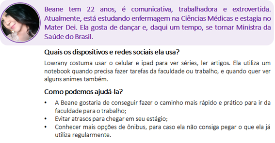
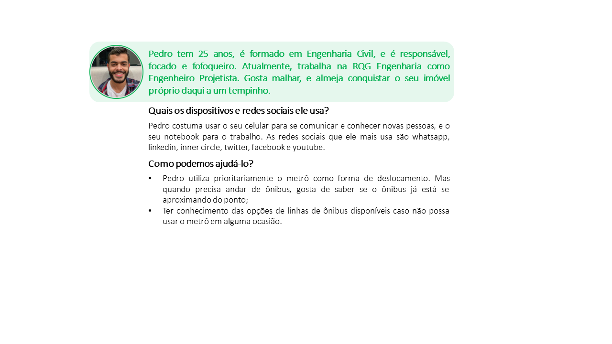
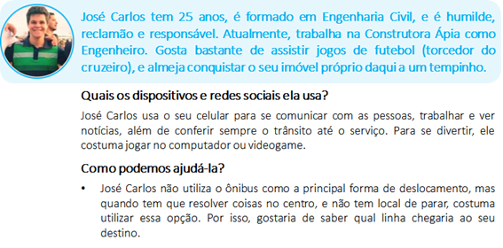
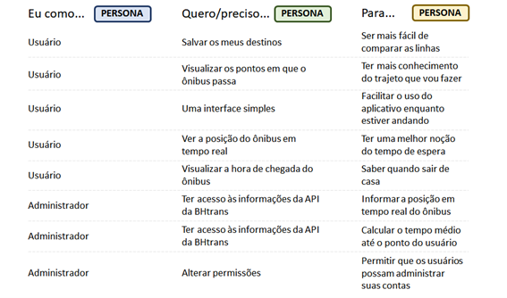
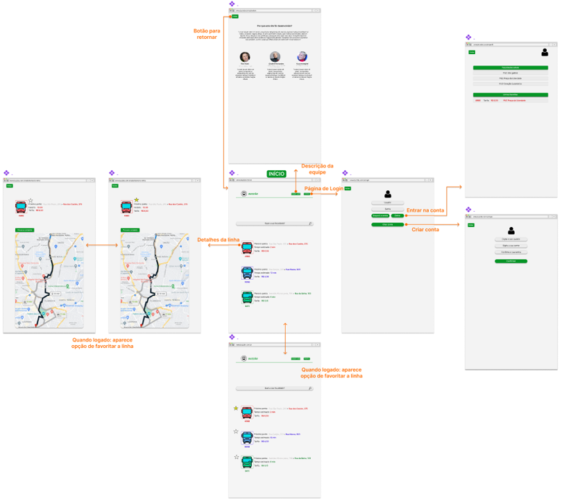

# Informações do Projeto
`TÍTULO DO PROJETO`  
>
>Mobilidade Urbana - Buzzão
>
`CURSO` 
>
> Engenharia de Software - PUC Minas Praça da Liberdade
> 
## Participantes
>
> Equipe envolvida no desenvolvimento do projeto: 
>
> - Guilherme Lage da Costa;
> - Renato Ramalho Teodoro de Oliveira Júnior;
> - Eduardo Vilela de Morais Rodrigues Moreira;
> - Mateus Guanabarino Freire de Castro;
> - Miguel Magalhães Freire de Castro;
> - Arthur Capanema Bretas.
>
# Estrutura do Documento

- [Informações do Projeto](#informações-do-projeto)
  - [Participantes](#participantes)
- [Estrutura do Documento](#estrutura-do-documento)
- [Introdução](#introdução)
  - [Problema](#problema)
  - [Objetivos](#objetivos)
  - [Justificativa](#justificativa)
  - [Público-Alvo](#público-alvo)
- [Especificações do Projeto](#especificações-do-projeto)
  - [Personas e Mapas de Empatia](#personas-e-mapas-de-empatia)
  - [Histórias de Usuários](#histórias-de-usuários)
  - [Requisitos](#requisitos)
    - [Requisitos Funcionais](#requisitos-funcionais)
    - [Requisitos não Funcionais](#requisitos-não-funcionais)
  - [Restrições](#restrições)
- [Projeto de Interface](#projeto-de-interface)
  - [User Flow](#user-flow)
  - [Wireframes](#wireframes)
- [Metodologia](#metodologia)
  - [Divisão de Papéis](#divisão-de-papéis)
  - [Ferramentas](#ferramentas)
  - [Controle de Versão](#controle-de-versão)
- [**############## SPRINT 1 ACABA AQUI #############**](#-sprint-1-acaba-aqui-)
- [Projeto da Solução](#projeto-da-solução)
  - [Tecnologias Utilizadas](#tecnologias-utilizadas)
  - [Arquitetura da solução](#arquitetura-da-solução)
- [Avaliação da Aplicação](#avaliação-da-aplicação)
  - [Plano de Testes](#plano-de-testes)
  - [Ferramentas de Testes (Opcional)](#ferramentas-de-testes-opcional)
  - [Registros de Testes](#registros-de-testes)
- [Referências](#referências)

# Introdução

## Problema
>
>A utilização do transporte público como principal forma de deslocamento é uma realidade de grande parte da população brasileira. Considerando essa perspectiva, os estudantes de faculdades e universidades configuram-se como uma parcela significativa desse espectro, e que merecem ser analisados. Com um mundo cada vez mais interconectado e rápido, esses estudantes, que de modo geral representam um grupo mais jovem, buscam alternativas práticas e imediatas para terem um maior controle sobre suas rotinas de horários, por meio de aplicativos, sites, ou outras referências.
>
>Partindo desse pressuposto, seria possível fornecer a essas pessoas uma informação clara e precisa sobre as linhas de ônibus que elas poderiam usar, para chegarem da maneira mais rápida e econômica ao seu local de estudo? Essa é uma dor presente no dia a dia dos estudantes que dependem dessas informações para se planejarem, e que será analisado no projeto a seguir.
>
## Objetivos

### Objetivo geral
>
>O objetivo geral deste projeto, é desenvolver uma plataforma web que ajude os estudantes a terem um maior controle das opções de ônibus disponíveis para chegarem  às suas faculdades e universidades.
>
### Objetivos específicos
>
> - Apresentar de maneira simples e prática as linhas de ônibus para a faculdade/universidade do usuário;
> - Demonstrar os horários em que cada uma das linhas passam em um determinado ponto;
> - Comparar as linhas disponíveis, avaliando qual seria a opção mais viável.
>
## Justificativa
>
>Segundo o IPEA (Instituto de pesquisa econômica aplicada), 65% da população brasileira utiliza o transporte público como principal forma de deslocamento nas capitais. Em pesquisas realizadas pelo instituto, verificou-se que mais de 90% dos passageiros consideram que andam em ônibus lotados e esperam mais de 30 minutos nos pontos de ônibus, uma vez que os horários muitas vezes não são respeitados.
>
>Em pesquisa realizada pela própria equipe do projeto, avaliamos um grupo composto em 87% por jovens de 18 a 30 anos, sendo que 65% são universitários e utilizam o ônibus como principal meio de transporte. Visando auxiliar os universitarios que andam de ônibus diariamente, o projeto em questão busca fornecer melhores rotas, informações acerca das linhas de ônibus e controle dos horários, para os universitários que buscam maior praticidade no momento de deslocamento de sua residência ao local de estudo.
>
## Público-Alvo
>
>Com base nos dados apresentados no capítulo de Justificativa, o publico alvo do presente estudo serão os estudantes de faculdades e universidades (homens e mulheres), com faixa etária de 18 a 30 anos, que residem em Belo Horizonte, e que utilizam o ônibus como o principal meio de deslocamento de sua casa ao local de estudo.
> 
# Especificações do Projeto
>
>Nesta seção, será apresentada uma visão mais detalhada e aprofundada do projeto em análise. Para isso, foram utilizadas das seguintes práticas:
> - Descrição de Personas: busca entender, em uma visão mais pessoal, as dores das pessoas relacionadas com o tema do estudo;
> - Histórias de usuários: indicação, na visão de usuários e administradores da plataforma, das funcionalidades/capacidades esperadas que podem lhe ajudar;  
> - Requisitos: quais são nossas 'exigências' em termos de funcionalidades da plataforma (requisitos funcionais) e demais aspectos (requisitos não funcionais); 
> - Restrições: definição dos limites do projeto.
>
## Personas e Mapas de Empatia
>
>Para um maior conhecimento acerca das pessoas que buscamos atingir e ajudar com esse projeto, foram realizadas entrevistas com 5 pessoas de diferentes áreas e grupos. Esses grupos variam desde estudantes, pessoas que estão estudando e estagiando simultaneamente, e pessoas que já se formaram, e estão inseridas no mercado de trabalho.
>
>Ademais, cabe mencionar que as entrevistas contemplaram pessoas que não necessariamente utilizam o ônibus como forma principal de deslocamento em seu dia a dia, mas que, em eventuais situações, fazem uso deste meio de transporte, como é o caso do Pedro e José Carlos. Considerando essas informações, a seguir são apresentadas as Personas mapeadas.
>
>**Lowrany Ferreira:**
>
> 
>
>**Beane do Carmo:**
>
> 
>
>**Tamara Andrade:**
>
> 
>
>**Pedro Guerra:**
>
> 
>
>**José Carlos:**
>
> 
>
## Histórias de Usuários

>Com base na análise das personas apresentadas acima, foram identificadas as seguintes histórias de usuários:
>
>
>
## Requisitos
>
>Com base nas pesquisas realizadas pela equipe, foram mapeados os principais requisitos (funcionais e não funcionais) detalham o escopo do projeto.
>
### Requisitos Funcionais
>
|ID    | Descrição do Requisito  | Prioridade |
|------|-----------------------------------------|----|
|RF-001| Permitir que o usuário salve os seus destinos | ALTA | 
|RF-002| Mostrar a posição do ônibus em tempo real   | ALTA |
|RF-003| Apresentar o horário de chegada esperado do ônibus | ALTA |
|RF-004| Apresentar os pontos nos quais o ônibus irá passar | MÉDIA |
|RF-005| Ter uma página com todas as informações de uma determinada linha específica | MÉDIA |
|RF-006| Ter uma página para o usuário ver os seus destinos salvos | MÉDIA |
|RF-007| Ver o custo para realizar o trajeto (com base na tarifa do ônibus) | MÉDIA |
|RF-008| Indicar qual seria a melhor linha, considerando o tempo médio e custo previsto | BAIXA |
|RF-009| Alertar ao usuário caso haja mudança no horário da linha | BAIXA |
|RF-010| Alertar o usuário quando o seu ônibus estiver se aproximando  | BAIXA |
>
### Requisitos não Funcionais
>
|ID     | Descrição do Requisito  |Prioridade |
|-------|-------------------------|----|
|RNF-001| Deve possuir acesso às informações da API do BHtrans | ALTA | 
|RNF-002| A interface deve ser simples e objetiva | ALTA | 
|RNF-003| O sistema deve ser responsivo em um dispositivos móvel | ALTA | 
|RNF-004| O sistema precisa ser executado tanto em desktops quanto dispositivos móveis | MÉDIA | 
|RNF-005| O tempo para apresentação da linha do ônibus não pode ser superior a 5 segundos | MÉDIA | 
|RNF-006| A interface deve possuir uma opção de acessibilidade  | BAIXA | 
> 
## Restrições
>
>O projeto em análise será restrito pelos itens apresentados conforme tabela a seguir.
>
|ID| Restrição                                             |
|--|-------------------------------------------------------|
|01| O projeto deverá ser entregue até o final do semestre |
|02| Não pode ser desenvolvido um módulo de back-end |
|03| Não podem ser feitos aportes financeiros no projeto |
>
# Projeto de Interface
>
>Pensando em uma forma mais dinâmica de se utilizar o sistema projetado e na praticidade necesária, foi desenhada uma interface com um conceito 'clean'. Ou seja, são necessários poucos cliques para que o usuário consiga a informação que deseja. A principal razão para isso são os cenários nos quais o usuário pode utilizar o Buzzão, seja enquanto se arruma para sair de casa ou enquanto anda na rua, por exemplo. 
>
>Neste sentido, a seguir são detalhados o userflow do site e os wireframes projetados.
>
## User Flow
>
>A seguir é detalhado o user flow elaborado para o projeto, considerando as premissas acima informadas.
>
>
>
>Para uma melhor visualização, este fluxo pode ser acessado por meio do seguinte [link](https://www.figma.com/file/wVv0JaD1McTy8OgkEo2D4Z/Buzz%C3%A3o---User-flow?node-id=0%3A1).
>
## Wireframes

......  INCLUA AQUI OS WIREFRAMES DAS TELAS DA APLICAÇÃO COM UM BREVE DESCRITIVO ......

> Wireframes são protótipos das telas da aplicação usados em design de interface para sugerir a
> estrutura de um site web e seu relacionamentos entre suas
> páginas. Um wireframe web é uma ilustração semelhante ao
> layout de elementos fundamentais na interface.
> 
> **Links Úteis**:
> - [Ferramentas de Wireframes](https://rockcontent.com/blog/wireframes/)
> - [Figma](https://www.figma.com/)
> - [Adobe XD](https://www.adobe.com/br/products/xd.html#scroll)
> - [MarvelApp](https://marvelapp.com/developers/documentation/tutorials/)
> 
> **Exemplo**:
> 
> 

# Metodologia
>
>A equipe utilizou o Design Thinking em todo o processo de entendimento do problema. Por meio dele, foi possível definir o objetivo, os mapas de personas e as histórias de usuários. Além disso, foram utilizadas diversas práticas do scrum, como reuniões diárias, divisão do grupo por funções, ficando a cargo de cada integrante a seleção das tarefas que ele iria realizar. Utilizamos também um fluxo de revisão, no qual cada integrante do grupo revisou o que foi feito pelos demais componentes.
>
>De modo a fornecer uma visão mais detalhada dos processos realizados pela equipe, apresenta-se a seguir os capítulos de 'divisão de papéis' e 'ferramentas'.
>
## Divisão de Papéis
>
>A tabela a seguir demonstra a equipe integrante do projeto e suas respectivas funções.
>
| Membro   | Função   |
| -------- | -------- |
| Guilherme Lage | Desenvolvedor e Scrum Master |
| Renato Ramalho | Desenvolvedor |
| Eduardo Vilela | Desenvolvedor |
| Miguel Magalhães | Desenvolvedor |
| Mateus Guanabarino | Desenvolvedor |
| Arthur Capanema | Desenvolvedor |
| Felipe Augusto | Project owner |
| Roberto Felipe | Project owner |
| Rommel Vieira  | Project owner |
>
>Conforme supramencionado, para realizar a divisão das atividades entre a equipe, adotamos a metodologia Kanban, em que cada um dos componentes escolhe as atividades que deseja fazer. A figura a seguir ilustra a divisão de tarefas do projeto, que pode ser consultado por meio deste [link](https://github.com/orgs/ICEI-PUC-Minas-PPLES-TI/projects/76/views/1).
>
>
>
## Ferramentas
>
>As ferramentas utilizadas no ao longo do processo foram:
>
| Ambiente  | Plataforma              |Link de Acesso |
|-----------|-------------------------|---------------|
|Processo de Design Thinking | Miro | [Desing Thinking](https://miro.com/app/board/uXjVPXxT7Fw=/) | 
|Repositório online | GitHub | [Repositorio Github](https://github.com/ICEI-PUC-Minas-PPLES-TI/plf-es-2022-2-ti1-7924100-mobilidade-urbana) |  
|Controle de versões | Git |[Git](https://git-scm.com/) |
|Acompanhamento das atividades - Kanban| GitHub Projects | [Kanban](https://github.com/orgs/ICEI-PUC-Minas-PPLES-TI/projects/76/views/1) |
|Protótipo Interativo - Wireframe | Figma | [Wireframe](https://www.figma.com/proto/cZuvPXMTUubx1HkE5WLvpg/Mobilidade-Urbana---Wireframes?node-id=17%3A1485&scaling=min-zoom&page-id=0%3A1&starting-point-node-id=17%3A63) | 
|Protótipo Interativo - Userflow | Figma | [Userflow](https://www.figma.com/file/fU3Vj6kHDgNxbCayeD29Dz/Mobilidade-Urbana---User-Flow?node-id=0%3A1) | 
|Comunicação | Discord e Whatsapp |
|Editor de código | Visual Studio Code |
> 
>As ferramentas listadas foram utilizadas por conta de sua praticidade na utilização e reconhecimento no mercado.
>
# **############## SPRINT 1 ACABA AQUI #############**

# Projeto da Solução

......  COLOQUE AQUI O SEU TEXTO ......

## Tecnologias Utilizadas

......  COLOQUE AQUI O SEU TEXTO ......

> Descreva aqui qual(is) tecnologias você vai usar para resolver o seu
> problema, ou seja, implementar a sua solução. Liste todas as
> tecnologias envolvidas, linguagens a serem utilizadas, serviços web,
> frameworks, bibliotecas, IDEs de desenvolvimento, e ferramentas.
> Apresente também uma figura explicando como as tecnologias estão
> relacionadas ou como uma interação do usuário com o sistema vai ser
> conduzida, por onde ela passa até retornar uma resposta ao usuário.
> 
> Inclua os diagramas de User Flow, esboços criados pelo grupo
> (stoyboards), além dos protótipos de telas (wireframes). Descreva cada
> item textualmente comentando e complementando o que está apresentado
> nas imagens.

## Arquitetura da solução

......  COLOQUE AQUI O SEU TEXTO E O DIAGRAMA DE ARQUITETURA .......

> Inclua um diagrama da solução e descreva os módulos e as tecnologias
> que fazem parte da solução. Discorra sobre o diagrama.
> 
> **Exemplo do diagrama de Arquitetura**:
> 
> 

# Avaliação da Aplicação

......  COLOQUE AQUI O SEU TEXTO ......

> Apresente os cenários de testes utilizados na realização dos testes da
> sua aplicação. Escolha cenários de testes que demonstrem os requisitos
> sendo satisfeitos.

## Plano de Testes

......  COLOQUE AQUI O SEU TEXTO ......

> Enumere quais cenários de testes foram selecionados para teste. Neste
> tópico o grupo deve detalhar quais funcionalidades avaliadas, o grupo
> de usuários que foi escolhido para participar do teste e as
> ferramentas utilizadas.
> 
> **Links Úteis**:
> - [IBM - Criação e Geração de Planos de Teste](https://www.ibm.com/developerworks/br/local/rational/criacao_geracao_planos_testes_software/index.html)
> - [Práticas e Técnicas de Testes Ágeis](http://assiste.serpro.gov.br/serproagil/Apresenta/slides.pdf)
> -  [Teste de Software: Conceitos e tipos de testes](https://blog.onedaytesting.com.br/teste-de-software/)

## Ferramentas de Testes (Opcional)

......  COLOQUE AQUI O SEU TEXTO ......

> Comente sobre as ferramentas de testes utilizadas.
> 
> **Links Úteis**:
> - [Ferramentas de Test para Java Script](https://geekflare.com/javascript-unit-testing/)
> - [UX Tools](https://uxdesign.cc/ux-user-research-and-user-testing-tools-2d339d379dc7)

## Registros de Testes

......  COLOQUE AQUI O SEU TEXTO ......

> Discorra sobre os resultados do teste. Ressaltando pontos fortes e
> fracos identificados na solução. Comente como o grupo pretende atacar
> esses pontos nas próximas iterações. Apresente as falhas detectadas e
> as melhorias geradas a partir dos resultados obtidos nos testes.

# Referências

......  COLOQUE AQUI O SEU TEXTO ......

> Inclua todas as referências (livros, artigos, sites, etc) utilizados
> no desenvolvimento do trabalho.
> 
> **Links Úteis**:
> - [Formato ABNT](https://www.normastecnicas.com/abnt/trabalhos-academicos/referencias/)
> - [Referências Bibliográficas da ABNT](https://comunidade.rockcontent.com/referencia-bibliografica-abnt/)
